# semeval

## 基本信息
- **项目名称**: SemEval 2026 Task 9 - Subtask 2: Multilingual Text Classification Challenge - Polarization Type Classification
### *f1分数结果*
---
| 模型       | 中文f1score|多语言f1score|
| :--------:   | :-----:       | :----: |
|bert-base-uncased|0.63|-|
|bert-base-chinese|0.72|-|
|hfl/chinese-macbert-large|0.75|-|
|hfl/chinese-roberta-wwm-ext-large |0.77|-|
|hfl/chinese-roberta-wwm-ext|0.77|-|
|IDEA-CCNL/Erlangshen-DeBERTa-v2-710M-Chinese|0.75|-|
|qwen3-max|-|0.37|
|microsoft/mdeberta-v3-base(优化前)|-|0.29|
|bert-base-multilingual-cased|-|0.36|
|microsoft/mdeberta-v3-base|-|0.42|
|xlm-roberta-large|-|0.46|
|microsoft/mdeberta-v3-base(22种语言)|-|0.41|
|xlm-roberta-large(22种语言)|-|0.43|
|focal loss(第一版)|-|0.35|
|focal loss(第二版)|-|0.46|
|FGM(第一版)|-|0.44|
---
- 由于支持Amharic, Arabic, Bengali, Burmese, Chinese, English, German, Hausa, Hindi, Italian, Khmer, Nepali, Odia, Persian, Polish, Punjabi, Russian, Spanish, Swahili, Telugu, Turkish, Urdu.这22种语言的编码器模型不多，因此最后选定在xlm-roberta-large上进行调整，最后的调整结果在Bengali，Hausa，Italian，Odia，Punjabi，Swahili，Telugu，English，German，Amharic这些语言上表现不是很好，观察数据集之后发现这些数据集的极化言论较少，因此选择人为数据增强。
## 11.17-11.23完成工作

### 1. 模型尝试 
#### bert-base-uncased
- BERT-Base-Uncased 是一种基于 Transformer 架构的预训练语言模型，由 Google 于 2018 年发布。它的特点是不区分大小写，在预处理阶段将所有文本转换为小写，这有助于减少模型的词汇大小。该模型具有 110M 参数，能够进行双向编码，从而更好地理解单词的上下文，广泛应用于文本分类、命名实体识别和情感分析等自然语言处理任务。
- 词汇处理
uncased: 所有文本转换为小写 词汇表大小: 30,522 个词符 分词方式: WordPiece 分词

#### bert-base-chinese
##### 由于bert-base-uncased对中文任务不够友好 因此更换为了bert-base-chinese模型 bert-base-chinese 继承了 BERT 架构的核心思想，并针对中文做了优化。
- 双向上下文理解：与传统的单向语言模型不同，BERT 在预训练时能够同时考虑一个词左右两侧的上下文，这使其能更深入地理解词语在特定语境中的确切含义。
- 针对中文的优化：模型在大规模中文语料（如中文百科、新闻、书籍等）上进行预训练，词汇表和语言知识更贴合中文环境 。它采用基于字符的分词方式，这有效规避了中文分词错误可能带来的影响。
#### hfl/chinese-roberta-wwm-ext
##### 由于bert-base-chinese模型调整参数后正确率提升不大 因此更换为了hfl/chinese-roberta-wwm-ext模型
- 全词掩码（WWM）策略：在预训练的掩码语言模型任务中，不是随机遮盖单个汉字，而是当某一个字被遮盖时，同一个词内的其他字也会被一同遮盖。例如，"语言模型"中的"模"被遮盖时，"型"也会被遮盖，模型需要学习预测整个"模型"一词。这种方式更符合中文以词为基本语义单元的特点，能促使模型更好地学习词汇级别的语义表示。
- RoBERTa优化：此模型采用了RoBERTa的优化策略，包括：移除了Next Sentence Prediction（NSP）任务，直接使用更长的序列（max_len=512）进行训练，并延长了训练步数（共计1M步）。这些改进使得模型能够更充分地学习语言表示。
- 对中文的专门优化：模型在大规模中文语料（包括中文维基百科及其他扩展数据，总词数达5.4B）上进行预训练，词汇表和语言知识更贴合中文环境。它采用基于字符的分词方式，这有效规避了中文分词错误可能带来的影响，同时通过全词掩码技术融入了词汇级别的信息，兼顾了字符和词汇的优势。
#### hfl/chinese-roberta-wwm-ext-large 
- 全词掩码（WWM）策略：在预训练的掩码语言模型（MLM）任务中，不是随机遮盖单个汉字，而是当某一个字被遮盖时，同一个词内的其他字也会被一同遮盖。例如，"语言模型"中的"模"被遮盖时，"型"也会被遮盖，模型需要学习预测整个"模型"一词。这种方式更符合中文以词为基本语义单元的特点，能促使模型更好地学习词汇级别的语义表示。
- RoBERTa优化：此模型采用了RoBERTa的优化策略，包括：移除了Next Sentence Prediction（NSP）任务，直接使用更长的序列（max_len=512）进行训练，并延长了训练步数（共计1M步）。这些改进使得模型能够更充分地学习语言表示。
- 更大的模型规模：作为BERT-large派生模型，它包含24层Transformers，16个Attention Head，1024个隐层单元。相比基础版模型（12层，768隐藏层），参数量显著增加，模型容量更大，能够捕捉更复杂的语言规律。
- 对中文的专门优化：模型在大规模中文语料上进行预训练，词汇表和语言知识更贴合中文环境。它采用基于字符的分词方式，这有效规避了中文分词错误可能带来的影响，同时通过全词掩码技术融入了词汇级别的信息，兼顾了字符和词汇的优势。
#### hfl/chinese-macbert-large
- MLM as correction (Mac)：这是 MacBERT 最核心的创新。在预训练阶段，传统的 BERT 模型会使用 [MASK] 标记来随机遮盖部分输入词，然后训练模型预测这些被遮盖的词。然而，这个 [MASK] 标记在后续的微调或实际应用阶段几乎从不会出现，这就导致了预训练和微调阶段的不一致。MacBERT 的解决方案是：不使用 [MASK] 标记进行遮盖，而是使用相似的词（同义词）进行替换。例如，它可能会用 "观看" 来替换 "看"，然后让模型预测原词 "看"。这种方式缓解了预训练和微调之间的差异。
- 全词掩码与N-gram掩码：MacBERT 结合了全词掩码（Whole Word Masking, WWM）技术。在中文中，当一个词被选中遮盖时，这个词包含的所有字都会被同时遮盖，这迫使模型学习词汇级别的整体语义，而不仅仅是单个字的信息。此外，模型还采用了 N-gram 掩码策略，可以遮盖连续的多字词（例如2-gram, 3-gram），以增强模型对更长短语的理解能力。
- 句子顺序预测：MacBERT 用句子顺序预测（Sentence-Order Prediction, SOP）任务替代了 BERT 中原有的下一句预测（NSP）任务。SOP 任务让模型判断两个句子在原文中的顺序是否被调换，这有助于模型更好地理解句子间的逻辑关系和文本的连贯性。
- 对中文的专门优化：模型在大规模中文语料上进行预训练。它采用基于字符的分词方式，同时通过全词掩码技术融入了词汇级别的信息，兼顾了字符和词汇的优势。
### 2. 数据增强
#### 对所有数据进行数据增强
```
class DataAugmenter:
    def __init__(self):
        pass
    
    def synonym_replacement(self, text, n=2):
        """同义词替换 - 使用jieba分词和简单的同义词替换"""
        words = list(jieba.cut(text))
        if len(words) <= 1:
            return text
            
        # 简单的同义词替换（这里使用一个简单的同义词字典，实际应用中可以使用更复杂的词典）
        synonym_dict = {
            '好': ['佳', '棒', '优秀', '出色'],
            '坏': ['差', '糟糕', '不好', '劣质'],
            '大': ['巨大', '庞大', '宏大', '广大'],
            '小': ['微小', '细小', '狭小', '迷你'],
            '说': ['讲', '道', '表示', '声称'],
            '看': ['瞧', '观', '注视', '瞥见'],
            '走': ['行', '步', '移动', '前进'],
            '快': ['迅速', '急速', '飞快', '快速'],
            '慢': ['缓慢', '迟缓', '悠悠', '慢吞吞']
        }
        
        new_words = words.copy()
        replaced = 0
        for i, word in enumerate(new_words):
            if word in synonym_dict and random.random() < 0.3 and replaced < n:
                new_words[i] = random.choice(synonym_dict[word])
                replaced += 1
                
        return ''.join(new_words)
    
    def random_swap(self, text, n=2):
        """随机交换词语"""
        words = list(jieba.cut(text))
        if len(words) <= 1:
            return text
            
        new_words = words.copy()
        for _ in range(min(n, len(words)//2)):
            idx1, idx2 = random.sample(range(len(words)), 2)
            new_words[idx1], new_words[idx2] = new_words[idx2], new_words[idx1]
            
        return ''.join(new_words)
    
    def random_deletion(self, text, p=0.1):
        """随机删除词语"""
        words = list(jieba.cut(text))
        if len(words) <= 1:
            return text
            
        new_words = []
        for word in words:
            if random.random() > p:
                new_words.append(word)
                
        if len(new_words) == 0:
            return words[random.randint(0, len(words)-1)]
            
        return ''.join(new_words)
    
    def random_insertion(self, text, n=1):
        """随机插入词语"""
        words = list(jieba.cut(text))
        if len(words) == 0:
            return text
            
        new_words = words.copy()
        for _ in range(n):
            random_word = random.choice(words)
            random_idx = random.randint(0, len(new_words))
            new_words.insert(random_idx, random_word)
            
        return ''.join(new_words)

    def augment_dataset(df, augmenter, num_augmentations=2):
    """对数据集进行增强"""
    augmented_data = []
    
    for _, row in df.iterrows():
        text = row['text']
        labels = row[['political', 'racial/ethnic', 'religious', 'gender/sexual', 'other']].values
        
        # 原始数据
        augmented_data.append({
            'text': text,
            'political': labels[0],
            'racial/ethnic': labels[1],
            'religious': labels[2],
            'gender/sexual': labels[3],
            'other': labels[4]
        })
        
        # 生成增强数据
        for i in range(num_augmentations):
            # 随机选择一种增强方法
            aug_method = random.choice([
                'synonym_replacement',
                'random_swap',
                'random_deletion',
                'random_insertion'
            ])
            
            if aug_method == 'synonym_replacement':
                augmented_text = augmenter.synonym_replacement(text)
            elif aug_method == 'random_swap':
                augmented_text = augmenter.random_swap(text)
            elif aug_method == 'random_deletion':
                augmented_text = augmenter.random_deletion(text)
            elif aug_method == 'random_insertion':
                augmented_text = augmenter.random_insertion(text)
            
            # 确保增强后的文本与原始文本不同且不为空
            if augmented_text != text and len(augmented_text.strip()) > 0:
                augmented_data.append({
                    'text': augmented_text,
                    'political': labels[0],
                    'racial/ethnic': labels[1],
                    'religious': labels[2],
                    'gender/sexual': labels[3],
                    'other': labels[4]
                })
    
    return pd.DataFrame(augmented_data)
```

#### 对单个数据进行数据增强
##### 由于other和political指标正确率较低 因此对这两项单独加强 但效果反而更差
```
class OtherLabelAugmenter:
    def __init__(self):
        # 构建更丰富的同义词词典，特别关注可能出现在other标签中的词汇
        self.synonym_dict = {
            # 负面情绪词汇
            '讨厌': ['厌恶', '憎恶', '反感', '嫌弃'],
            '生气': ['愤怒', '恼火', '气愤', '发怒'],
            '害怕': ['恐惧', '畏惧', '惊恐', '胆怯'],
            '伤心': ['悲伤', '难过', '悲痛', '哀伤'],
            '失望': ['绝望', '沮丧', '失落', '灰心'],
            
            # 正面情绪词汇
            '喜欢': ['喜爱', '爱好', '钟意', '倾心'],
            '开心': ['快乐', '高兴', '愉快', '喜悦'],
            '满意': ['满足', '称心', '如意', '惬意'],
            
            # 中性描述词汇
            '奇怪': ['古怪', '奇异', '怪异', '离奇'],
            '重要': ['关键', '紧要', '主要', '重大'],
            '困难': ['艰难', '艰巨', '艰辛', '困苦'],
            '简单': ['容易', '简便', '轻松', '简易'],
            
            # 程度副词
            '非常': ['极其', '十分', '特别', '格外'],
            '有点': ['稍微', '略微', '稍稍', '些许'],
            '完全': ['彻底', '全然', '完全', '绝对'],
            
            # 常见动词
            '认为': ['觉得', '以为', '感觉', '想'],
            '知道': ['了解', '明白', '清楚', '知晓'],
            '帮助': ['协助', '帮忙', '援助', '支持'],
            '改变': ['变化', '转变', '变更', '改动']
        }
        
        # other标签可能涉及的话题模板
        self.other_templates = [
            "这真是{}的情况。",
            "我对这件事感到{}。",
            "这种情况让我觉得{}。",
            "这确实是一个{}的问题。",
            "我感到非常{}。",
            "这种事情真是{}。"
        ]
    
    def synonym_replacement(self, text, n=3):
        """同义词替换 - 针对other标签优化"""
        words = list(jieba.cut(text))
        if len(words) <= 1:
            return text
            
        new_words = words.copy()
        replaced = 0
        
        # 优先替换在词典中的词
        for i, word in enumerate(new_words):
            if word in self.synonym_dict and random.random() < 0.4 and replaced < n:
                new_words[i] = random.choice(self.synonym_dict[word])
                replaced += 1
                
        return ''.join(new_words)
    
    def random_swap(self, text, n=2):
        """随机交换词语"""
        words = list(jieba.cut(text))
        if len(words) <= 1:
            return text
            
        new_words = words.copy()
        for _ in range(min(n, len(words)//2)):
            idx1, idx2 = random.sample(range(len(words)), 2)
            new_words[idx1], new_words[idx2] = new_words[idx2], new_words[idx1]
            
        return ''.join(new_words)
    
    def random_deletion(self, text, p=0.15):
        """随机删除词语 - 针对other标签调整概率"""
        words = list(jieba.cut(text))
        if len(words) <= 1:
            return text
            
        new_words = []
        for word in words:
            if random.random() > p:
                new_words.append(word)
                
        if len(new_words) == 0:
            return words[random.randint(0, len(words)-1)]
            
        return ''.join(new_words)
    
    def random_insertion(self, text, n=2):
        """随机插入词语 - 针对other标签增加插入数量"""
        words = list(jieba.cut(text))
        if len(words) == 0:
            return text
            
        new_words = words.copy()
        for _ in range(n):
            random_word = random.choice(words)
            random_idx = random.randint(0, len(new_words))
            new_words.insert(random_idx, random_word)
            
        return ''.join(new_words)
    
    def template_based_augmentation(self, text):
        """基于模板的增强 - 专门为other标签设计"""
        # 提取文本中的关键词
        words = list(jieba.cut(text))
        keywords = [word for word in words if len(word) > 1 and word in self.synonym_dict]
        
        if not keywords:
            return text
            
        # 随机选择一个模板并插入关键词
        template = random.choice(self.other_templates)
        keyword = random.choice(keywords)
        
        # 50%的概率使用原词，50%的概率使用同义词
        if random.random() > 0.5 and keyword in self.synonym_dict:
            keyword = random.choice(self.synonym_dict[keyword])
            
        augmented_text = template.format(keyword)
        
        # 50%的概率将原文本与模板文本结合
        if random.random() > 0.5:
            combined_text = text + " " + augmented_text
            return combined_text[:min(len(combined_text), len(text) + 20)]  # 限制长度
            
        return augmented_text
    
    def sentence_splitting(self, text):
        """句子分割与重组 - 针对较长的other标签文本"""
        # 使用jieba分句（简单实现）
        sentences = []
        current_sentence = []
        
        for word in jieba.cut(text):
            current_sentence.append(word)
            # 简单的句子结束判断
            if word in ['。', '！', '？', '，'] and len(current_sentence) > 5:
                sentences.append(''.join(current_sentence))
                current_sentence = []
                
        if current_sentence:
            sentences.append(''.join(current_sentence))
            
        if len(sentences) <= 1:
            return text
            
        # 随机重组句子
        random.shuffle(sentences)
        return ''.join(sentences)

  def augment_other_label_dataset(df, augmenter, other_augmentations=5, non_other_augmentations=1):
    """专门针对other标签进行增强的数据集增强函数"""
    augmented_data = []
    
    for _, row in df.iterrows():
        text = row['text']
        labels = row[label_columns].values
        is_other = row['other'] == 1
        
        # 原始数据
        augmented_data.append({
            'text': text,
            'political': labels[0],
            'racial/ethnic': labels[1],
            'religious': labels[2],
            'gender/sexual': labels[3],
            'other': labels[4]
        })
        
        # 确定增强次数
        num_augmentations = other_augmentations if is_other else non_other_augmentations
        
        # 生成增强数据
        for i in range(num_augmentations):
            # 对于other标签，使用更多样化的增强方法
            if is_other:
                aug_method = random.choice([
                    'synonym_replacement',
                    'random_swap',
                    'random_deletion', 
                    'random_insertion',
                    'template_based_augmentation',
                    'sentence_splitting'
                ])
            else:
                aug_method = random.choice([
                    'synonym_replacement',
                    'random_swap',
                    'random_deletion'
                ])
            
            if aug_method == 'synonym_replacement':
                augmented_text = augmenter.synonym_replacement(text)
            elif aug_method == 'random_swap':
                augmented_text = augmenter.random_swap(text)
            elif aug_method == 'random_deletion':
                augmented_text = augmenter.random_deletion(text)
            elif aug_method == 'random_insertion':
                augmented_text = augmenter.random_insertion(text)
            elif aug_method == 'template_based_augmentation':
                augmented_text = augmenter.template_based_augmentation(text)
            elif aug_method == 'sentence_splitting':
                augmented_text = augmenter.sentence_splitting(text)
            
            # 确保增强后的文本与原始文本不同且不为空
            if augmented_text != text and len(augmented_text.strip()) > 0:
                augmented_data.append({
                    'text': augmented_text,
                    'political': labels[0],
                    'racial/ethnic': labels[1],
                    'religious': labels[2],
                    'gender/sexual': labels[3],
                    'other': labels[4]
                })
    
    return pd.DataFrame(augmented_data)
```
### 3. 参数调整
## 11.24-11.30完成工作
### 单语言数据集训练并预测
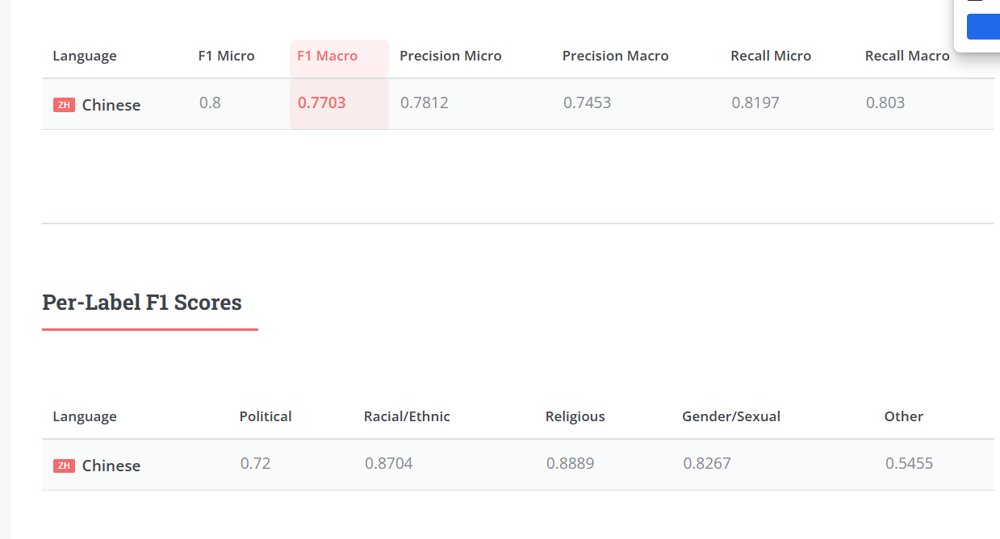
### qwen3-max
- 使用qwen3-max零样本提示学习对13个测试集进行预测，结果如下。
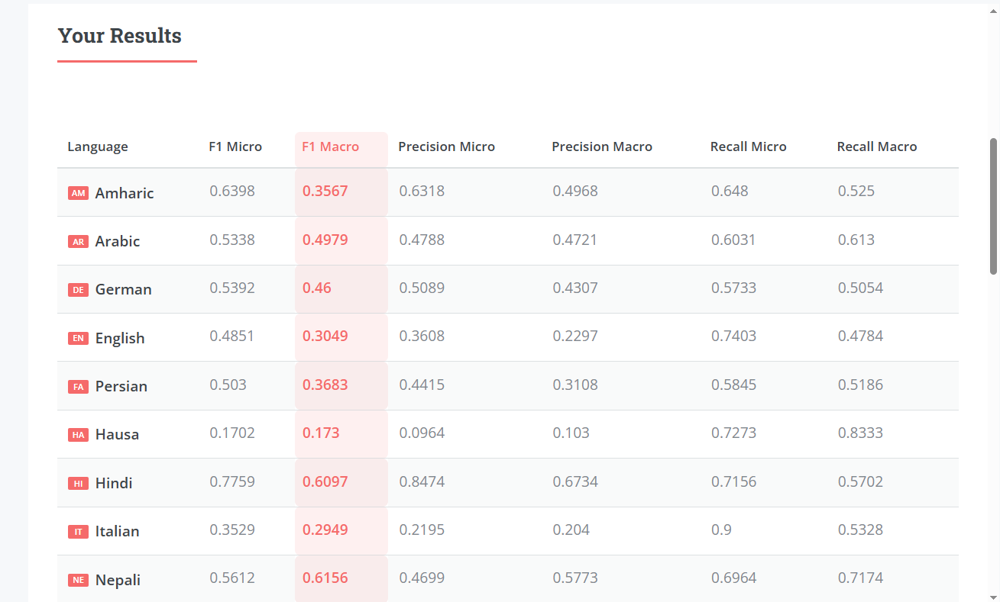
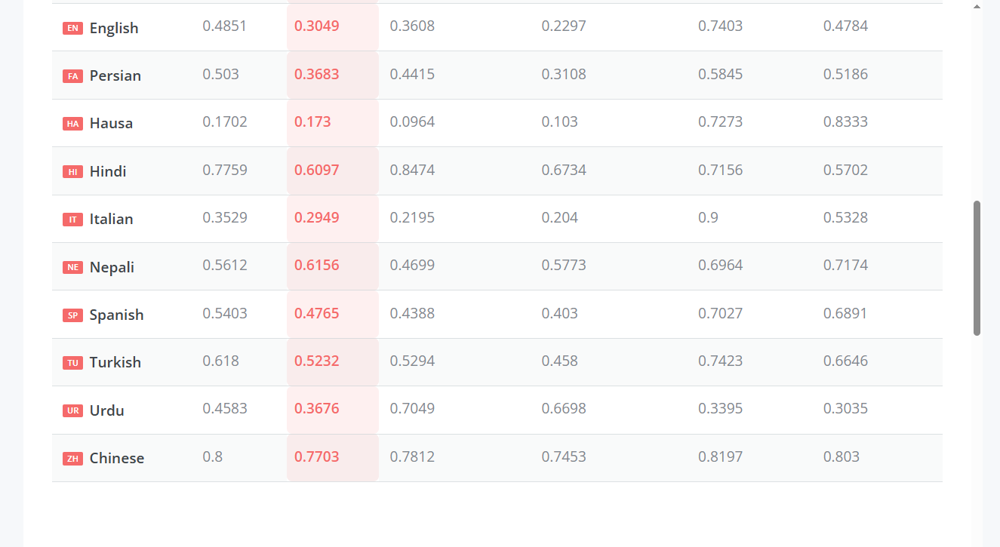
### 多语言大模型
- 对多语言模型使用bert-base-multilingual-cased进行训练，并对13个测试集进行预测，结果如下。
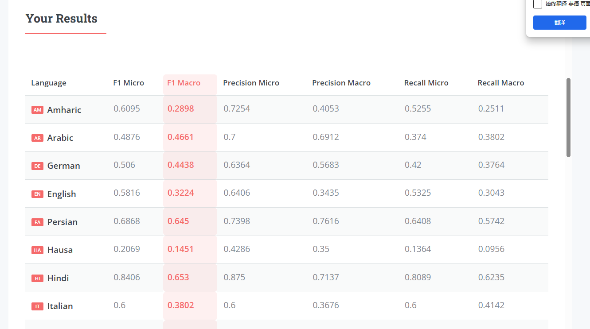
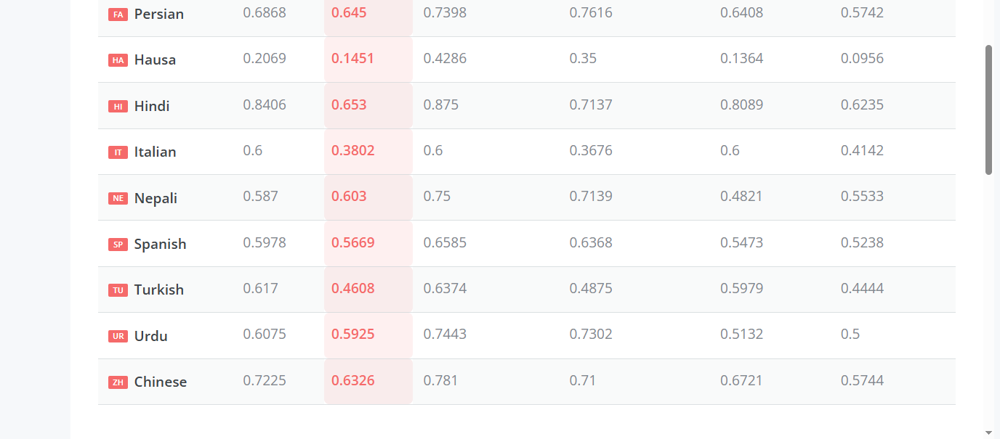
## 12.1-12.7完成工作
### microsoft/mdeberta-v3-base
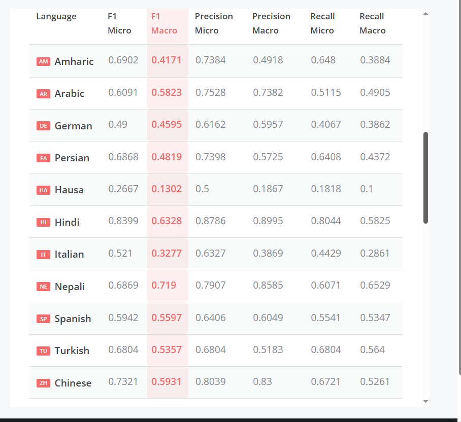
- learning_rate=1e-5,  
- batch_size=4,        
- accumulation_steps=8
#### 主办方增加了九种语言后结果
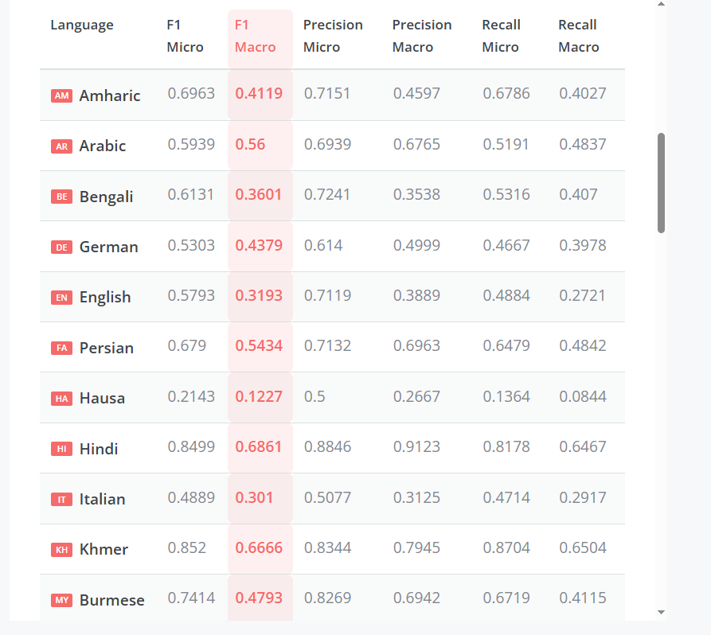
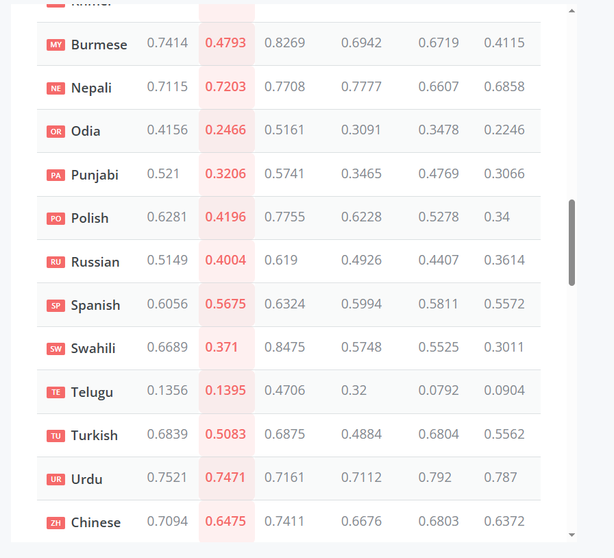
### xlm-roberta-large
#### 沿用之前的方法对xlm-roberta-large训练会出现预测全0 损失波动过大的情况 于是增加了梯度累积功能、优化器和线性预热
- 优化器

            self.optimizer = torch.optim.AdamW(
                model.parameters(),
                lr=learning_rate,
                weight_decay=0.01,  # 增加权重衰减
                eps=1e-8
            )
- 线性预热
  ```
            total_steps = len(train_dataset) * 3 // (batch_size * accumulation_steps)
            warmup_steps = int(0.1 * total_steps)  # 10%的warmup
            self.scheduler = get_linear_schedule_with_warmup(
                self.optimizer,
                num_warmup_steps=warmup_steps,
                num_training_steps=total_steps
            )
- 梯度累积
  ```
            # 梯度累积：将损失除以累积步数
            loss = outputs.loss / self.accumulation_steps
            loss.backward()
            total_loss += outputs.loss.item()
            # 梯度累积
            accumulation_counter += 1
            if accumulation_counter % self.accumulation_steps == 0:
                # 梯度裁剪 - 防止梯度爆炸
                torch.nn.utils.clip_grad_norm_(self.model.parameters(), max_norm=1.0)
                self.optimizer.step()
                self.scheduler.step()
                self.optimizer.zero_grad()
                accumulation_counter = 0
  
            # 处理剩余的梯度
            if accumulation_counter > 0:
                torch.nn.utils.clip_grad_norm_(self.model.parameters(), max_norm=1.0)
                self.optimizer.step()
                self.scheduler.step()
                self.optimizer.zero_grad()
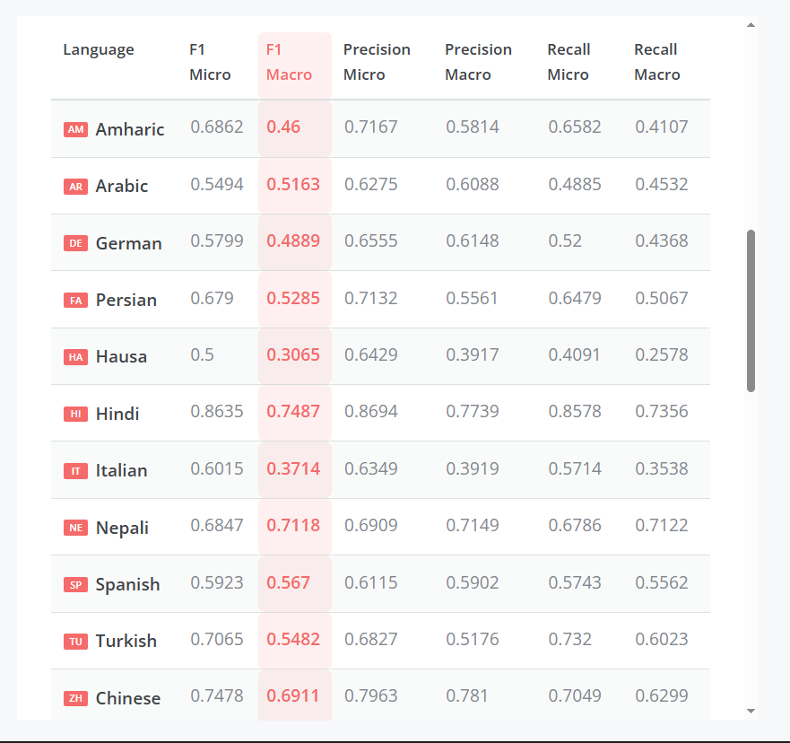
- learning_rate=1e-5,  
- batch_size=4,        
- accumulation_steps=8
#### 主办方增加了九种语言后结果
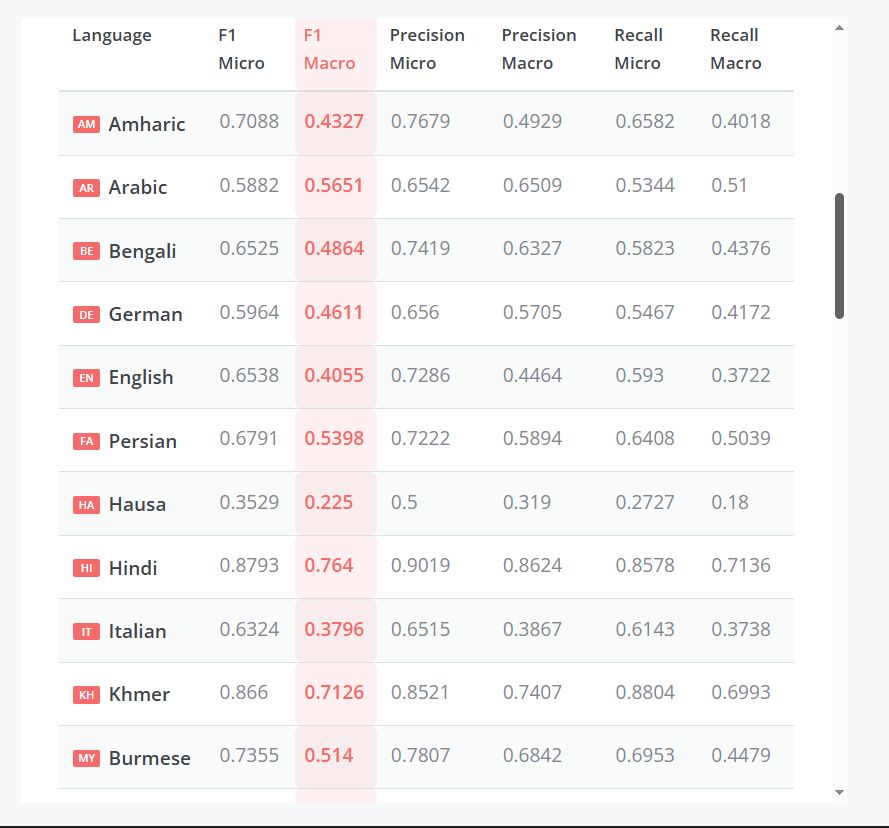
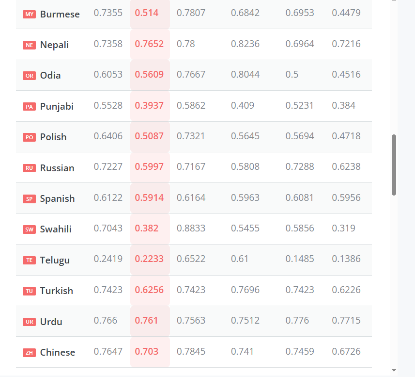
#### 调整learning_rate=2e-5
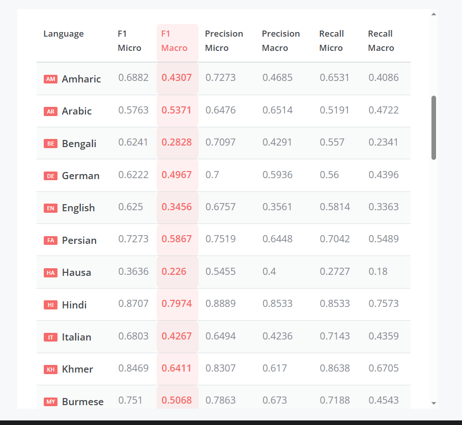
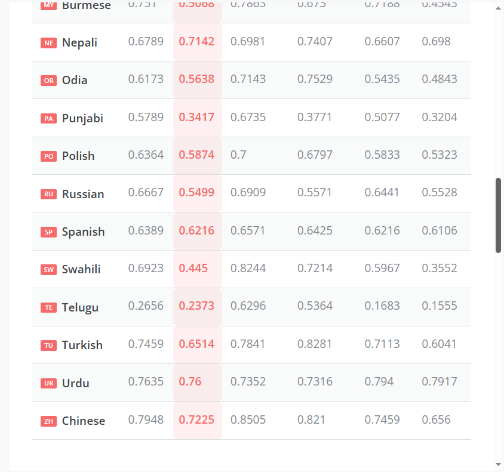
#### 调整batch_size=8
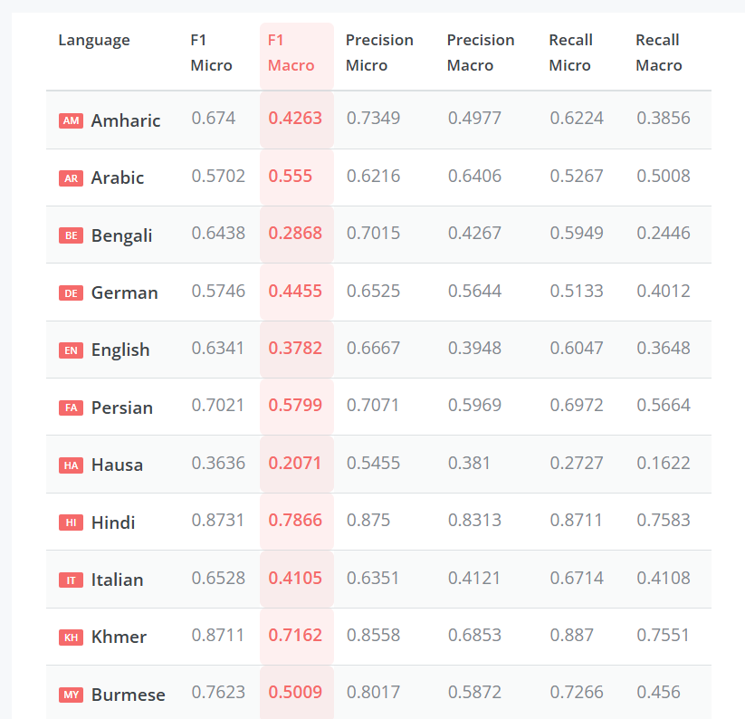
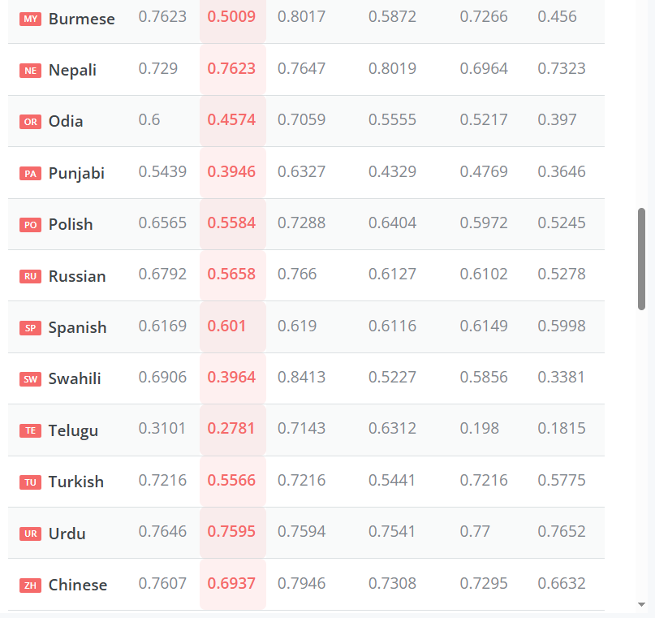
### IDEA-CCNL/Erlangshen-DeBERTa-v2-710M-Chinese
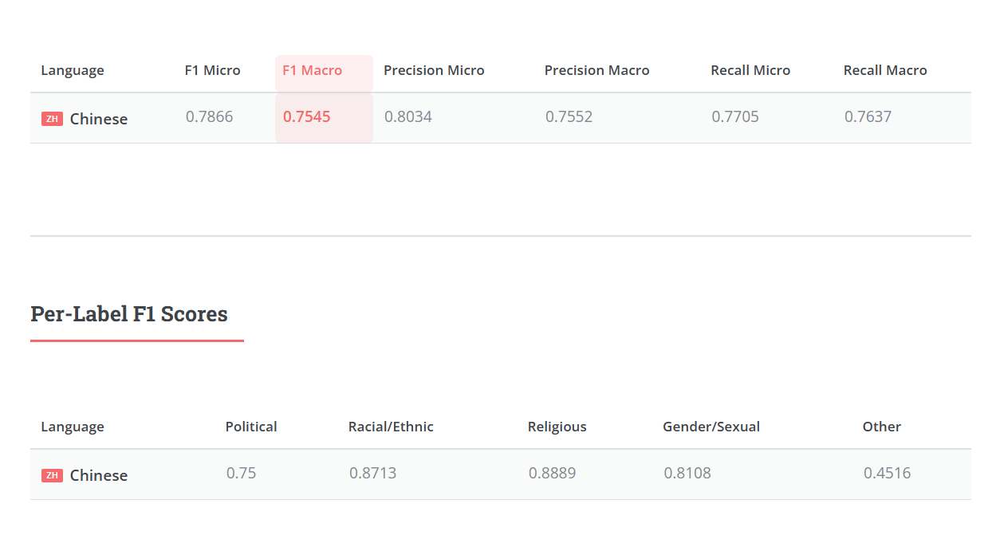


